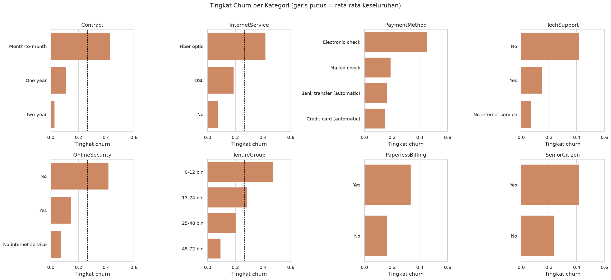
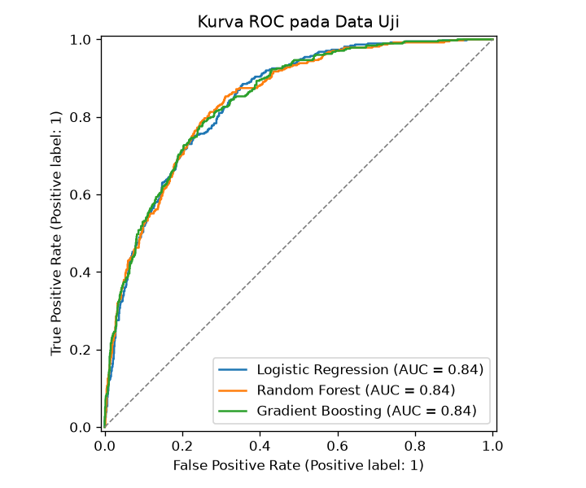
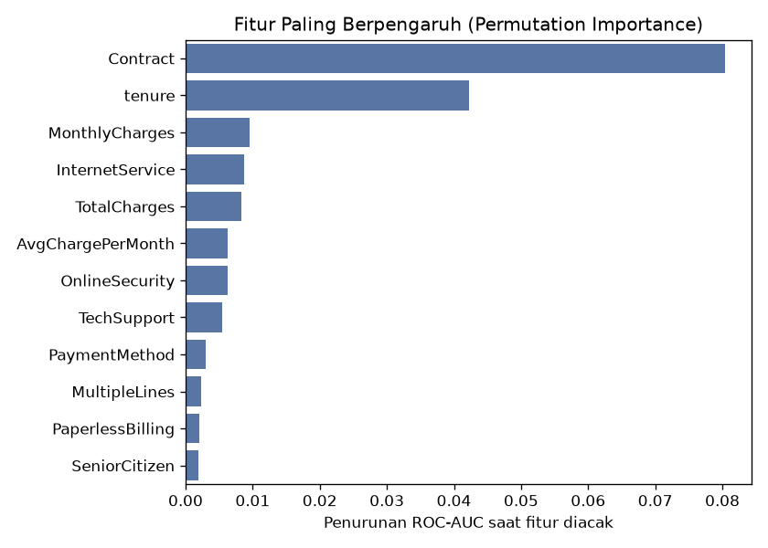

# Prediksi Churn Pelanggan Telekomunikasi

Project sains data *end-to-end* untuk memprediksi pelanggan yang berisiko berhenti berlangganan (*churn*) pada perusahaan telekomunikasi, mulai dari pembersihan data, *exploratory data analysis* (EDA), pemodelan *machine learning*, hingga rekomendasi bisnis.

**Penulis:** Iqbal Ryuka — Sains Data, Fakultas Ilmu Komputer dan Teknologi Informasi, Universitas Muhammadiyah Sumatera Utara



## Rumusan Masalah
1. Bagaimana karakteristik pelanggan yang melakukan churn?
2. Seberapa baik model *machine learning* dapat memprediksi churn?
3. Faktor apa yang paling berpengaruh terhadap churn, dan apa rekomendasi untuk perusahaan?

## Dataset
[IBM Telco Customer Churn](https://github.com/IBM/telco-customer-churn-on-icp4d) — 7.043 pelanggan, 21 kolom:

| Kelompok | Kolom |
|---|---|
| Demografi | `gender`, `SeniorCitizen`, `Partner`, `Dependents` |
| Layanan | `PhoneService`, `MultipleLines`, `InternetService`, `OnlineSecurity`, `OnlineBackup`, `DeviceProtection`, `TechSupport`, `StreamingTV`, `StreamingMovies` |
| Akun | `tenure`, `Contract`, `PaperlessBilling`, `PaymentMethod`, `MonthlyCharges`, `TotalCharges` |
| Target | `Churn` (Yes/No) |

## Metodologi
1. **Pembersihan data** — 11 nilai `TotalCharges` kosong (semuanya pelanggan dengan `tenure = 0`) diisi 0; target diubah ke 0/1.
2. **Feature engineering** — `AvgChargePerMonth` dan `TenureGroup`.
3. **EDA** — distribusi target, distribusi fitur numerik, tingkat churn per kategori, korelasi.
4. **Pemodelan** — `Pipeline` scikit-learn (`StandardScaler` + `OneHotEncoder`) dengan tiga model: Logistic Regression, Random Forest, Gradient Boosting.
5. **Evaluasi** — split 80/20 *stratified*, 5-fold *Stratified Cross-Validation*, metrik ROC-AUC, precision, recall, F1.
6. **Penyesuaian threshold** dan **permutation importance** untuk interpretasi.

## Hasil

**Cross-validation (5-fold, data latih)**

| Model | ROC-AUC | F1 | Recall | Precision |
|---|---|---|---|---|
| Gradient Boosting | **0,848** ± 0,011 | 0,583 | 0,522 | 0,661 |
| Logistic Regression | 0,846 ± 0,011 | 0,628 | 0,796 | 0,518 |
| Random Forest | 0,846 ± 0,010 | 0,631 | 0,765 | 0,537 |

**Data uji (threshold 0,5)**

| Model | Accuracy | Precision | Recall | F1 | ROC-AUC |
|---|---|---|---|---|---|
| Logistic Regression | 0,733 | 0,498 | 0,791 | 0,612 | 0,842 |
| Random Forest | 0,762 | 0,535 | 0,778 | 0,634 | 0,842 |
| Gradient Boosting | 0,804 | 0,674 | 0,508 | 0,579 | 0,843 |

Ketiga model memiliki ROC-AUC yang sebanding (±0,84). Dengan menurunkan threshold Gradient Boosting ke ±0,34, recall kelas churn naik dari 0,51 menjadi 0,73 (F1 0,58 → 0,63).

<p float="left">
  
  
</p>

## Temuan Utama
- **26,5%** pelanggan melakukan churn.
- **Kontrak bulanan** memiliki tingkat churn 42,7%, dibanding 11,3% (1 tahun) dan 2,8% (2 tahun).
- Median **tenure** pelanggan churn hanya 10 bulan vs 38 bulan untuk yang bertahan.
- Pelanggan **Fiber optic**, pembayaran **Electronic check**, serta yang **tidak memakai Tech Support / Online Security** lebih rentan churn.

## Rekomendasi Bisnis
1. Beri insentif bagi pelanggan bulanan untuk beralih ke kontrak jangka panjang.
2. Fokuskan program retensi pada 12 bulan pertama berlangganan.
3. Evaluasi harga dan kualitas layanan Fiber optic.
4. Tawarkan bundel Tech Support & Online Security.
5. Dorong metode pembayaran otomatis.

## Struktur Folder
```
prediksi-churn-pelanggan/
├── data/
│   └── telco_customer_churn.csv     # dataset mentah
├── notebooks/
│   └── analisis_churn.ipynb         # EDA + pemodelan lengkap dengan narasi
├── reports/
│   ├── figures/                     # grafik hasil analisis
│   └── metrics.json                 # ringkasan metrik dari train.py
├── src/
│   ├── data_prep.py                 # memuat & membersihkan data
│   └── train.py                     # pelatihan & evaluasi model
├── requirements.txt
└── README.md
```

## Cara Menjalankan
```bash
cd projects/prediksi-churn-pelanggan
python -m venv .venv
source .venv/bin/activate        # Windows: .venv\Scripts\activate
pip install -r requirements.txt

# melatih & mengevaluasi model (menghasilkan reports/metrics.json dan grafik)
python src/train.py

# membuka notebook analisis
jupyter notebook notebooks/analisis_churn.ipynb
```

## Pengembangan Lanjutan
- *Hyperparameter tuning* (GridSearchCV / Optuna), XGBoost / LightGBM.
- Pemilihan threshold berbasis biaya retensi vs kehilangan pelanggan, menggunakan data validasi terpisah.
- Interpretasi per pelanggan dengan SHAP.
- *Deployment* sederhana dengan Streamlit.

## Tools
Python · pandas · NumPy · scikit-learn · matplotlib · seaborn · Jupyter
